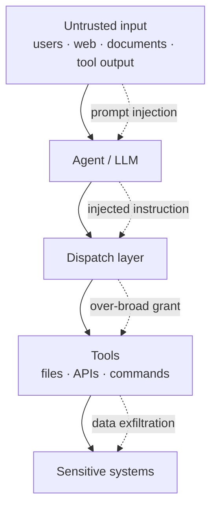
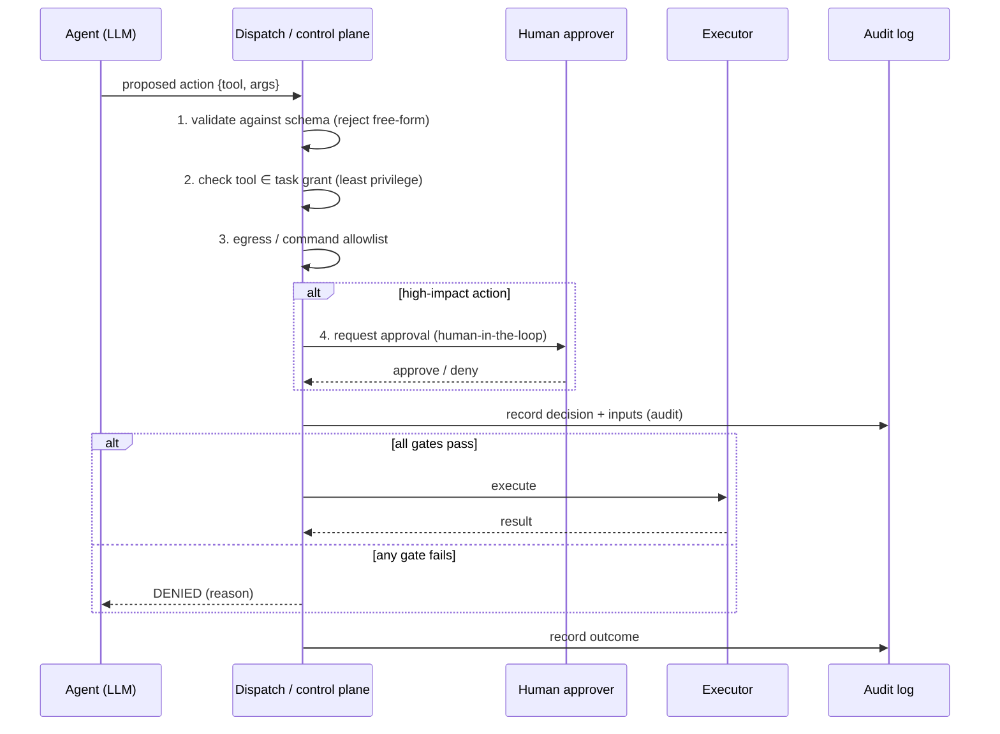

<!-- Copyright © 2026 SurgeXi Business Intelligence, a Teamsmith Enterprises LLC company. All Rights Reserved. -->
# Architecture & Case Study — Securing Agentic AI Systems

> A defense-only reference for hardening agents that hold tools and autonomy.
> Distilled from a capability-dispatch + approval + audit control plane I
> designed. No proprietary code, policies, or internal systems are included.

## 1. Context & problem

The moment an LLM can call tools — read files, hit APIs, run commands, send
messages — its output stops being text and becomes *action*. The attack surface
moves with it:

- An agent **cannot reliably distinguish its instructions from the data it's
  processing**. A retrieved document or web page can try to become a command
  (prompt injection).
- A compromised or confused agent's blast radius is **exactly the set of tools
  you handed it**.
- Free-form model output driving real actions means **one malformed generation
  can trigger an irreversible operation**.

Defense here is about **containment, not perfect detection**. You assume
injection will sometimes succeed and design so that it doesn't matter.

## 2. Threat model

## 3. The control plane — every action is mediated

No tool call goes straight from the model to an executor. It passes through a
single choke point where the layers stack — each assumes the others might fail
(**defense in depth**).

## 4. The patterns (and the control each maps to)

| Risk | Primary control | Pattern |
|------|-----------------|---------|
| Prompt injection via content | Input segregation + output validation | Treat all non-authored content as inert, labeled data |
| Over-broad agent permissions | Least-privilege tool scoping | Grant tools per-task, read-only by default |
| Tool-execution compromise | Sandboxing / isolation | No ambient credentials; no network unless required; hard resource ceiling |
| Irreversible harmful action | Human-in-the-loop gate | High-impact actions pause for explicit approval |
| Data exfiltration | Egress allowlisting | Define permitted destinations; deny by default |
| "What happened?" after an incident | Audit | Every decision + input + outcome is logged immutably |

See [`examples/secure_agent.py`](examples/secure_agent.py) for a runnable demo
of validation → least-privilege → egress allowlist → approval gate, and
[`docs/adr/`](docs/adr/) for the decision records.

## 5. Key design decisions

1. **Allowlist, never blocklist.** Define what's permitted (domains, commands,
   paths); everything else is denied. Chasing an infinite list of forbidden
   things always loses.
2. **Structured output before any side effect.** The model proposes a *schema-
   constrained* action; the dispatcher validates it *before* it reaches a tool.
   Free-form text never executes.
3. **Autonomy is a dial, not a switch.** Low-risk tools auto-approve; high-risk
   ones (money, deletion, external comms) require a human gate. The line is a
   policy field, not code.
4. **Audit is not optional.** If you can't reconstruct who did what with which
   inputs, you can't run agents in an environment that matters.

## 6. Trade-offs

- **Friction vs. safety** — approval gates slow high-impact actions. That's the
  point; the dial lets you tune where the friction sits.
- **Allowlist maintenance** — allowlists need upkeep as legitimate needs grow.
  Accepted: a slightly stale allowlist fails *closed*, which is the safe way.
- **Containment ≠ detection** — this design largely gives up on perfectly
  *detecting* injection and instead ensures a successful injection can't reach
  anything dangerous.

## 7. Alignment

The patterns map onto the **OWASP Top 10 for LLM Applications** (prompt
injection, excessive agency, insecure output handling) and the **NIST AI Risk
Management Framework** (govern / map / measure / manage). This is the posture
enterprise AI-security roles are now hiring for.

## 8. Where this came from

Distilled from a production control plane that mediates agent actions with
capability scoping, approval gates, and an immutable audit trail. The
implementation stays private; the defensive patterns are meant to be shared —
that's how the whole field gets safer.
