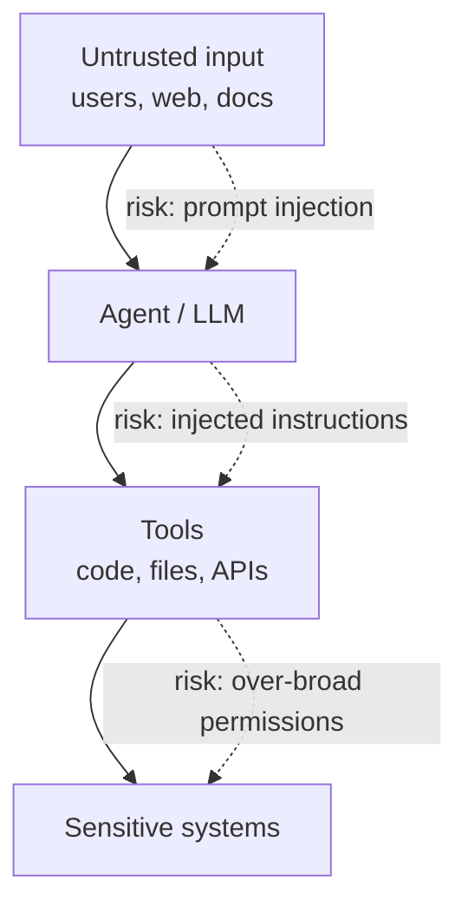

# 🛡️ secure-agent-patterns

> Defensive patterns for **hardening agentic AI systems** — how to give an LLM tools and autonomy without giving away the keys to the kingdom.

A practitioner's reference for the security side of agentic AI. As LLMs gain the ability to call tools, browse, and act, the attack surface shifts. This repo collects the **defensive** patterns I apply when designing agent systems — the same posture enterprise AI-security roles are now hiring for.

> This is defense-only material: it shows how to *protect* agent systems, not how to attack them.

---

## The threat model (at a glance)

The core problem: an agent can't fully tell the difference between *its instructions* and *the data it's processing*. A malicious document can try to become a command. Defense is about containment, not perfect detection.

## The patterns

### 1. Treat all model input as untrusted
Any content the model didn't author — user messages, retrieved documents, web pages, tool outputs — is potentially adversarial. Segregate it, label it, and never let it silently escalate into instructions.

### 2. Least-privilege tool scoping
An agent should hold the **minimum** capability needed for its task. Read-only by default. Scope tools per-task, not per-agent. The blast radius of a compromised agent is exactly the set of tools you handed it.

### 3. Agent isolation / sandboxing
Run tool execution in an isolated environment with no ambient credentials, no network unless required, and a hard resource ceiling. Compromise should stay contained to the sandbox.

### 4. Structured output validation
Don't trust free-form model output to drive actions. Constrain it to a schema, validate it, and reject anything malformed *before* it reaches a tool.

### 5. Allowlist, don't blocklist
Define what's permitted (which domains, which commands, which file paths) rather than chasing an infinite list of what's forbidden.

### 6. Human-in-the-loop gates
High-impact actions — sending money, deleting data, external communication — pause for explicit approval. Autonomy is a dial, not a switch.

### 7. Defense in depth
No single control is sufficient. Input segregation **and** output validation **and** sandboxing **and** approval gates. Each layer assumes the others might fail.

## Pattern → control map

| Risk | Primary control |
|------|----------------|
| Prompt injection via content | Input segregation + output validation |
| Over-broad agent permissions | Least-privilege tool scoping |
| Tool-execution compromise | Sandboxing / isolation |
| Irreversible harmful action | Human-in-the-loop gate |
| Data exfiltration | Egress allowlisting |

## Who this is for

Architects and engineers building agentic systems who need to ship them into environments where security actually matters — regulated industries, customer data, production infrastructure.

## References

Aligns with industry guidance including the OWASP Top 10 for LLM Applications and NIST's AI risk-management framing.

## Architecture & case study

For the full write-up — problem framing, architecture diagrams, sequence
flows, design-decision records (ADRs), and trade-offs — see
**[ARCHITECTURE.md](ARCHITECTURE.md)** and the [ADRs](docs/adr/).

## License

MIT — see [LICENSE](LICENSE).

---

*Part of my AI‑platform work — see my other [pinned repositories](https://github.com/tsmith-surgexi) and the platform they support at [SurgeXi](https://surgexi.com).*
